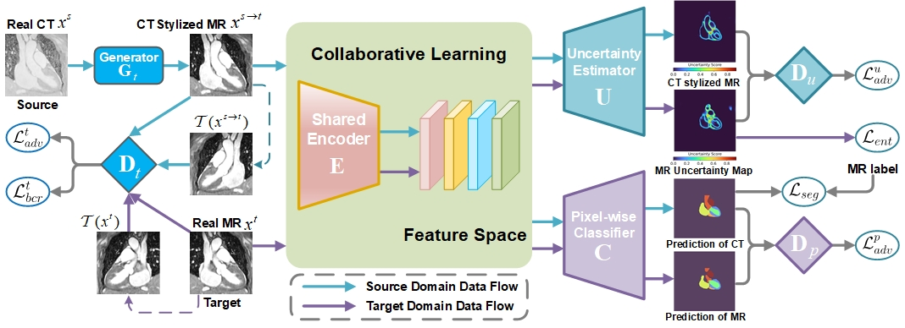

-----------
 This repo is used to share the implementations of our paper **Unsupervised Cross-Modality Adaptation with Consistency-regularized Appearance and Uncertainty-aware Feature Alignment for Medical Image Segmentation**.<br/>
-----------

## Paper
[Unsupervised Cross-Modality Adaptation with Consistency-regularized Appearance and Uncertainty-aware Feature Alignment for Medical Image Segmentation]
<br/>
IEEE Transactions on Image Processing
<br/>
<br/>
<p align="center">
  
</p>

## Installation
* Install TensorFlow 1.10 and CUDA 9.0
* Clone this repo
```
git clone https://github.com/zongdaoming/cruea
cd cruea
```

# Environments


## Data Preparation
* Raw data needs to be written into `tfrecord` format to be decoded by `./data_loader.py`. The training data can be downloaded [here](https://drive.google.com/file/d/1m9NSHirHx30S8jvN0kB-vkd7LL0oWCq3/view). The testing CT data can be downloaded [here](https://drive.google.com/file/d/1SJM3RluT0wbR9ud_kZtZvCY0dR9tGq5V/view). The testing MR data can be downloaded [here](https://drive.google.com/file/d/1RNb-4iYWUaFBY61rFAnT2XT0mtwlnH1V/view).

* Put `tfrecord` data of two domains into corresponding folders under `./data` accordingly.
* Run `./create_datalist.py` to generate the datalists containing the path of each data.

## Code Structure


## Train
* Modify paramter values in `./config_param.json`
* Run `./main.py` to start the training process

## Evaluate
* Specify the model path and test file path in `./evaluate.py`
* Run `./evaluate.py` to start the evaluation.

## Todo List

- [x] Tensorflow Impletation  :bowtie:
- [x] Function Wrapper :bowtie:
- [x] Code Tree :bowtie:
- [ ] Pytorch Impletation  :exclamation:
- [ ] Adding More Backbone Networks  :exclamation:
- [ ] Pre-training weight Upload  :exclamation:


## Note
* The repository is being updated
* Contact: Daoming Zong (ecnuzdm@gmail.com)


## Acknowledgement
Part of the code is borrowed from the Tensorflow implementation of [CycleGAN](https://github.com/leehomyc/cyclegan-1) and [SIFA](https://github.com/cchen-cc/SIFA).
