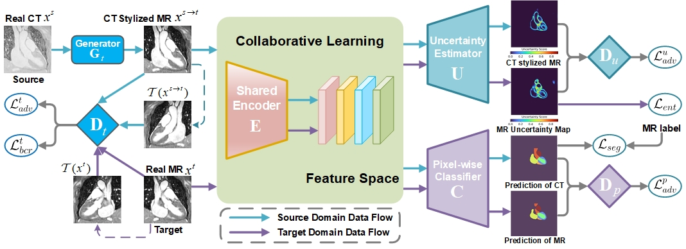

## 
This repo is used to share our implementation of the paper **Unsupervised Cross-Modality Adaptation with Consistency-regularized Appearance and Uncertainty-aware Feature Alignment for Medical Image Segmentation**.<br/>

## Paper
[Unsupervised Bidirectional Cross-Modality Adaptation via Deeply Synergistic Image and Feature Alignment for Medical Image Segmentation](https://arxiv.org/abs/2002.02255)
<br/>
IEEE Transactions on Image Processing
<br/>
<br/>
<p align="center">
  
</p>

## Installation
* Install TensorFlow 1.10 and CUDA 9.0
* Clone this repo
```
git clone https://github.com/zongdaoming/cruea
cd cruea
```

## Data Preparation
* Raw data needs to be written into `tfrecord` format to be decoded by `./data_loader.py`. The pre-processed data has been released from our work [PnP-AdaNet](https://github.com/carrenD/Medical-Cross-Modality-Domain-Adaptation). The training data can be downloaded [here](https://drive.google.com/file/d/1m9NSHirHx30S8jvN0kB-vkd7LL0oWCq3/view). The testing CT data can be downloaded [here](https://drive.google.com/file/d/1SJM3RluT0wbR9ud_kZtZvCY0dR9tGq5V/view). The testing MR data can be downloaded [here](https://drive.google.com/file/d/1RNb-4iYWUaFBY61rFAnT2XT0mtwlnH1V/view).
* Put `tfrecord` data of two domains into corresponding folders under `./data` accordingly.
* Run `./create_datalist.py` to generate the datalists containing the path of each data.

## Train
* Modify paramter values in `./config_param.json`
* Run `./main.py` to start the training process

## Evaluate
* Specify the model path and test file path in `./evaluate.py`
* Run `./evaluate.py` to start the evaluation.

## Acknowledgement
Part of the code is revised from the [Tensorflow implementation of CycleGAN](https://github.com/leehomyc/cyclegan-1) and [Tensorflow implementation of SIFA](https://github.com/cchen-cc/SIFA).

## Note
* The repository is being updated
* Contact: Daoming Zong (ecnuzdm@gmail.com)
